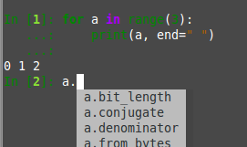

#Jupyter/IPython newsletter for Date. 


# Misc links to write about:


## prompt_toolkit in Jupyter Console and IPython

Our two terminal interfaces - Jupyter Console and IPython - have switched from
using readline to [prompt_toolkit](https://pypi.python.org/pypi/prompt_toolkit),
a pure Python library for terminal interaction. Code is now highlighted as you
type, and multi-line editing and pasting are much improved. This should also
make installation easier - we no longer need pyreadline on Windows or
gnureadline on Mac.



Jupyter Console is the Jupyter terminal frontend, which can communicate with
kernels to run many different languages. IPython is the single-process Python
shell. These changes will arrive in version 5.0 of each package.

* [IPython pull request](https://github.com/ipython/ipython/pull/9118)
* [Jupyter Console pull request](https://github.com/jupyter/jupyter_console/pull/57)

## nbstripout

People keep reinventing the wheel and write their own [git
filter](https://github.com/adrn/DropOutput/issues/1) that clean-up outputs of
notebook in VCS. While we think that output should be stored – for example to
be rendered ion nbviewer – we understand the needs for such filters:


Nice to see Jovyans getting together, and write a tool
that can easily be installed/uninstalled to add git hooks:

    https://github.com/kynan/nbstripout

```
$ pip install nbstripout
$ cd git/repository
$ nbstripout install
```
